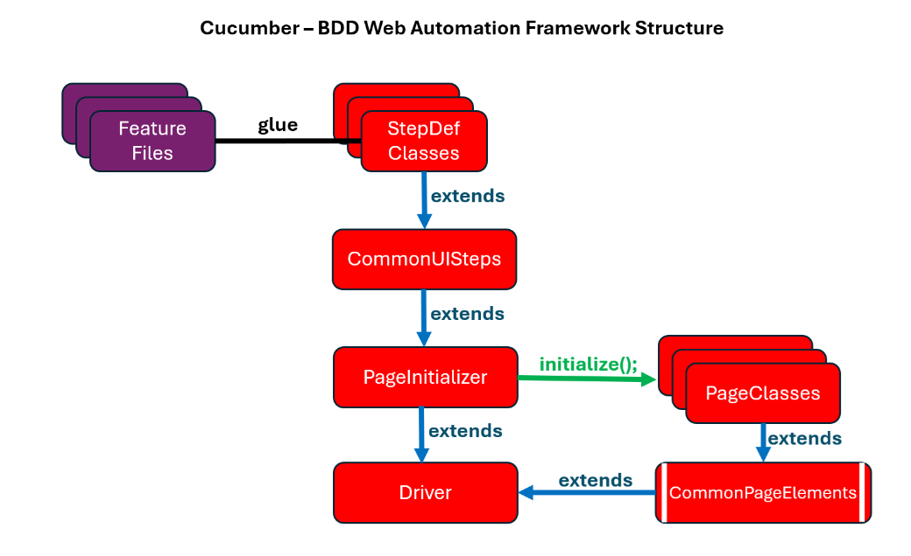

# SauceDemo Cucumber BDD Framework

## Overview
This project is a Cucumber-based BDD (Behavior-Driven Development) framework for testing the SauceDemo application. It integrates Selenium WebDriver for UI automation and follows the Page Object Model (POM) design pattern for maintainability and scalability.

---

## Framework Structure
The framework is organized into the following key modules, leveraging **strong inheritance** and **reusability** to create a powerful testing solution. The structure is illustrated in the diagram below:



### Explanation of the Diagram
1. **Feature Files**: These contain Gherkin scenarios defining the behavior of the application. They act as the starting point of the framework and are linked to the StepDef classes using the `glue` attribute in the Cucumber runner.

2. **StepDef Classes**: These classes are the core of the framework. Each StepDef class maps Gherkin steps to Java methods and extends the `CommonUISteps` class, enabling access to common reusable methods and utilities.

3. **CommonUISteps**: This class serves as a base for StepDef classes, containing reusable methods for UI interactions. It extends the `PageInitializer` class, ensuring all page objects are readily available.

4. **PageInitializer**: This class initializes all Page Classes and provides their objects to the higher-level classes (e.g., `CommonUISteps` and `StepDef`).

5. **Page Classes**: Each page of the application is represented by a Page Class, encapsulating its locators and actions. These classes inherit from `CommonPageElements` to reuse shared locators and methods.

6. **CommonPageElements**: This class centralizes locators and methods shared across multiple pages, reducing duplication and enhancing maintainability.

7. **Driver**: This class provides the WebDriver instance and ensures seamless interaction with the browser. It is extended by `PageInitializer`, making the WebDriver accessible throughout the framework.

### Key Strengths
- **Strong Inheritance**: Each layer of the framework builds upon the previous, providing access to all required utilities, methods, and page objects without redundancy.
- **Reusability**: Common locators, methods, and utilities are centralized, minimizing duplication and making the framework scalable.

### 1. **Page Classes**
Located in `src/test/java/saucedemo/pages`, these classes represent different pages of the application. Each class contains locators and methods specific to the corresponding page.
- **`CommonPageElements`**: Contains reusable locators and methods that are common across multiple pages.
- **`PageInitializer`**: A utility class used to initialize all page classes. This ensures page objects are instantiated and ready for use in Step Definition classes.

### 2. **Step Definitions (StepDef)**
Found in `src/test/java/saucedemo/step_definitions`, these classes are the heart of the framework. Due to the inheritance structure, all the parent class features and components can be reached from StepDef classes. StepDef classes:
- Contain Gherkin step implementations.
- Access all page elements, page methods, and reusable common methods.
- Utilize the WebDriver instance (if necessary) via the `Driver` class.

### 3. **Utilities**
Located in `src/test/java/saucedemo/utilities`, these classes provide support functionality:
- **`CommonSteps`**: Includes reusable methods that can be called across multiple Step Definitions.
- **`ConfigurationReader`**: Reads properties from the `configuration.properties` file.
- **`Driver`**: Manages WebDriver instances.
- **`ExcelUtil`**: Provides utility functions to interact with Excel files.
- **`Log`**: Implements the logging mechanism using Log4j.

### 4. **Logging Mechanism**
The framework uses Log4j for logging purposes. Configuration is provided in `log4j.properties`. Logs are generated in `src/test/java/saucedemo/logs/log.txt`, which records test execution details for debugging and reporting.

### 5. **Feature Files**
Located in `src/test/resources/features`, these contain Gherkin scenarios describing the behavior of the application.

### 6. **Runners**
Located in `src/test/java/saucedemo/runners`, these classes execute the test scenarios:
- **`CukesRunner`**: Main test runner.
- **`FailedTestRunner`**: Used to rerun failed tests.

---

## Key Components

### CommonSteps Class
- Contains reusable methods shared across different StepDef classes.
- Example: Utility methods for handling common UI interactions or validations.

#### Key Methods in CommonSteps
1. **`waitForElement`**: Waits for a specific element to become visible or clickable before proceeding.
   - **Parameters**: Locator of the element.
   - **Purpose**: Ensures the element is ready for interaction.

2. **`clickElement`**: Performs a click action on the specified element.
   - **Parameters**: Locator of the element.
   - **Purpose**: Simplifies click interactions.

3. **`sendKeysToElement`**: Sends text input to a specified input field.
   - **Parameters**: Locator of the element, text to be sent.
   - **Purpose**: Automates text entry actions.

4. **`verifyElementText`**: Validates that an element's text matches the expected value.
   - **Parameters**: Locator of the element, expected text.
   - **Purpose**: Confirms correct text is displayed.

5. **`captureScreenshot`**: Captures a screenshot of the current page for debugging purposes.
   - **Parameters**: None.
   - **Purpose**: Records visual evidence for troubleshooting.

6. **`scrollToElement`**: Scrolls the page until the specified element is in view.
   - **Parameters**: Locator of the element.
   - **Purpose**: Handles elements not immediately visible in the viewport.

7. **`getElementAttribute`**: Retrieves the value of a specified attribute from an element.
   - **Parameters**: Locator of the element, attribute name.
   - **Purpose**: Fetches dynamic values like `id`, `class`, or `value`.

8. **`waitForPageToLoad`**: Waits for the page to load completely.
   - **Parameters**: Timeout duration.
   - **Purpose**: Ensures smooth test execution by waiting for all resources to load.

9. **`isElementDisplayed`**: Checks if a specific element is displayed on the page.
   - **Parameters**: Locator of the element.
   - **Purpose**: Validates the presence of UI elements.

These methods streamline common interactions and validations, making test steps more concise and reusable.

### CommonPageElements Class
- Provides locators and methods for elements common to multiple pages.
- Reduces code duplication and centralizes shared elements.

### PageInitializer Class
- Instantiates all page objects only once while instantiating the driver instance, and they can be used whenever they are needed.
- Example Usage:
  ```java
   public static LoginPage loginPage;
   public static CartPage cartPage;
   public static productsPage productsPage;
  public PageInitializer() {
      loginPage = new LoginPage();
      cartPage = new CartPage();
      productsPage = new ProductsPage();
  }
  ```

### Logging Mechanism
- Configured using Log4j (`log4j.properties` file).
- Logs detailed test execution steps in `log.txt`.
- Each test execution step is logged for analysis. 
- Reports are generated based on the test execution.

---

